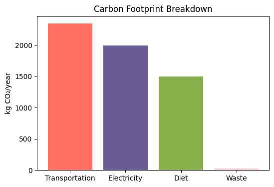

# Carbon Footprint Calculator 🌱

This is an interactive Python project to estimate your personal annual CO₂ emissions based on:
- Transportation
- Electricity usage
- Diet
- Waste & recycling habits

Built with Python, Matplotlib, and ipywidgets. Perfect for Google Colab.

## How to use
1. Open the notebook in Google Colab.
2. Adjust the sliders and dropdowns.
3. Click "Calculate Carbon Footprint" to see your emissions and breakdown.

## Example Output

